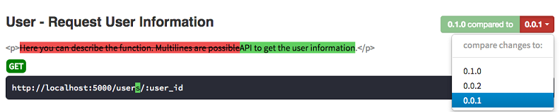

# ApiDoc API文档自动生成工具apiDoc简介

随着移动客户端的流行，后端系统需开放越来越多的API来供客户端使用。API文档的编写和管理是一个挑战，随着API不断变化，文档必须及时更新，但编写文档也是个不小的负担。一个比较好的做法(Best Practice)，就是将文档放在代码里，开发人员编写代码时同时修改文档。然后通过工具从代码中抽出文档，并生成方便用户阅读的格式。此类工具早已存在，比如Java中的javadoc。这里我们要介绍一个非常轻量级的，适用于几乎所有流行语言的，针对Restful API的文档自动生成工具－apiDoc。

## 工具安装
- 需要nodejs & npm 环境
```
npm install apidoc -g
```
全局安装apiDoc。之后，你就可以执行下面的命令来生成文档：
```
apidoc -i src -o dest
```
该命令从当前工作目录的”src”子目录下读取所有代码文件，并从中抽取apiDoc的文档注释，然后生成HTML格式的文档，并保存在”dest”子目录下。执行完后，用户就可以打开”dest”下的”index.html”来阅读文档。

“apidoc”命令支持许多参数，常用的有：

- t template
> 根据”template”子目录下的模板生成文档，缺省时采用apiDoc的默认模板。用户也可以编写自己的模板。关于模板的细节，本文不多介绍了。

- f “.*\\.py$”
> 只解析Python代码。”-f”后的参数按正则匹配，可以设置多个”-f”参数。

- h
> 显示该命令帮助信息。

## 配置文件
运行apidoc前，你需先有一个配置文件，放在代码根目录下（如上例中的src目录），取名为”apidoc.json”。下面是一个标准配置文件的例子：
```json
{
  "name": "User API Document",
  "version": "0.1.0",
  "description": "A sample of User API document generated from apiDoc",
  "title": "User API",
  "url" : "http://localhost:5000",
  "sampleUrl": "http://localhost:5000",
  "header": {
    "title": "Overview",
    "filename": "header.md"
  },
  "footer": {
    "title": "Copyright",
    "filename": "footer.md"
  },
  "template": {
    "withCompare": true,
    "withGenerator": true
  }
}
```
- name, version, description
> 这三个配置项的内容会显示在生成文档的最上方，其中name即整个文档的大标题。

- title
> 网页的标题，显示在浏览器标签上。

- url
> 文档中每个API地址的前缀。

- sampleUrl
> 当有此项时，每个API文档的最后会有Sample Request测试部分。该配置项是测试API地址的前缀。

- header, footer
> 页面的头和尾。当多个页面都有相同的头和尾时，这个配置项就非常有用。子配置项中

- title
> 页面左边菜单栏中显示的标题。

- filename
> 指向页头或页尾的模板文件，apiDoc使用的是Markdown文件。

- template 
    - withCompare
    > 生成的文档有版本比较功能。后面会介绍。默认为”true”。

    - withGenerator
    > 生成的文档页尾带有一段文字，表示这个文档是由apiDoc生成的，加上这个代表对作者的尊重吧。默认为”true”。

让我们简单写下页头和页尾的Markdown文件，并将它们同”apidoc.json”放在一起，即”src”目录下。

header.md
```
## Overview
Below is the API doc of User APIs.
```

footer.md
```
Copyright © 2014 - 2018 [www.garylv.com](https://www.garylv.com/) All Rights Reserved
```

## API文档注释
```python
class User(Resource):
    """
    @api {get} /users/:user_id Request User Information
    @apiVersion 0.1.0
    @apiName GetUser
    @apiGroup User
    @apiPermission admin
 
    @apiDescription API to get the user information.
 
    @apiExample Example usage:
    curl -i http://localhost:5000/users/2
 
    @apiParam {Number} user_id The user's unique ID.
 
    @apiSuccess {String} name Name of the User.
    @apiSuccessExample {json} Success-Response:
        HTTP/1.1 200 OK
        {
            "name": "Tom"
        }
 
    @apiError UserNotFound The <code>user_id< /code> of the User was not found.
 
    @apiErrorExample {json} Error-Response:
        HTTP/1.1 404 Not Found
        {
            "error": "UserNotFound",
            "message": "User {user_id} doesn't exist"
        }
 
    @apiSampleRequest http://localhost:5000/users/:user_id
    """
    def get(self, user_id):
        abort_if_not_exist(user_id)
        return USER_LIST[user_id]
```
**注意，上例中”/code”标签内有一个空格，如果你复制这段代码的话记得把空格去掉。**

- @api {get} /users/:user_id Request User Information
> 最主要的参数，”{get}”定义了HTTP请求是GET，API地址是”/users/:user_id”，文档中API的名称是”Request User Information”。

- @apiVersion 0.1.0
> API的版本号，默认显示在API名称的右方。该参数可用来在不同的版本之间做比较，后面会介绍。

- @apiName GetUser
> API名称，不影响文档。

- @apiGroup User
> API分组名，文档内容中和菜单栏中同一组的API会在一同显示，方便阅读。

- @apiPermission admin
> API的访问权限，文档中默认会API地址下面显示。没有权限要求的话，此项可以省略。

- @apiDescription API to get the user information.
> API的详细描述，默认显示在API名称的下方。

- @apiExample Example usage:
> API调用示例，该参数的下一行就是示例的内容，直到有空行结束。可以定义多个@apiExample，默认在文档中会以标签形式列出，标签名就是”Example usage:”。

- @apiParam {Number} user_id The user’s unique ID.
> API参数字段介绍，”{Number}”定义了字段类型，”user_id”是字段名称，后面则是字段描述。可以定义多个@apiParam字段。

- @apiSuccess {String} name Name of the User.
> API成功后返回的字段，如同@apiParam，”{String}”定义了字段类型，”name”是返回字段名称，后面则是字段描述。可以定义多个@apiSuccess字段。

- @apiSuccessExample {json} Success-Response:
> 显示一个API成功返回后Response响应的示例，”{json}”代表响应体是JSON类型。该参数的下行就是响应体内容，直到有空行结束。可以定义多个@apiSuccessExample，默认在文档中会以标签形式列出，标签名就是”Success-Response:”。

- @apiError UserNotFound User was not found.
> API发生错误后的返回，”UserNotFound”是错误名称，后面则是错误描述。可以定义多个错误返回。

- @apiErrorExample {json} Error-Response:
> 显示一个API错误返回后Response响应的示例，”{json}”代表响应体是JSON类型。该参数的下行就是响应体内容，直到有空行结束。可以定义多个@apiErrorExample，默认在文档中会以标签形式列出，标签名就是”Error-Response:”。

- @apiSampleRequest http://localhost:5000/users/:user_id
> 文档提供的API Sample测试的地址。其实在”apidoc.json”中配过”sampleUrl”项后，此参数即可省去，除非这个API的测试URL比较特殊，需特别指定。

## 参数信息重用
相同的成功响应示例，或者相同的错误返回,在apiDoc中，这叫继承(inherit)。首先，你要在源代码注释中用”@apiDefine”定义这个宏。比如，下面的注释，就是把上例中”UserNotFound”错误及其响应示例定义在一个名叫”UserNotFoundError”的宏中。此后，所有需要使用这段文档的地方，就通过”@apiUse UserNotFoundError”引入这个宏即可。
```python
class User(Resource):
    """
    @apiDefine UserNotFoundError
 
    @apiError UserNotFound The <code>user_id< /code> of the User was not found.
 
    @apiErrorExample {json} Error-Response:
    HTTP/1.1 404 Not Found
    {
        "error": "UserNotFound",
        "message": "User {user_id} doesn't exist"
    }
    """
 
    """
    @api {get} /users/:user_id Request User Information
    ...
    @apiUse UserNotFoundError
    """
    def get(self, user_id):
        # Code here
 
 
    """
    @api {delete} /users/:user_id Delete a User
    ...
    @apiUse UserNotFoundError
    """
    def delete(self, user_id):
        # Code here
```

当宏定义比较多时，怎么管理呢？我们可以把宏定义挪到代码以外去。让我们在”src”根目录下建立一个文件”_apidoc.py”。然后把上面”UserNotFoundError”的定义移到这个文件中。

```python
"""
    @apiDefine UserNotFoundError
 
    @apiVersion 0.1.0
 
    @apiError UserNotFound The <code>user_id</ code> of the User was not found.
 
    @apiErrorExample {json} Error-Response:
        HTTP/1.1 404 Not Found
        {
            "error": "UserNotFound",
            "message": "User {user_id} does not exist"
        }
 """
```
执行下apidoc命令，看下效果吧。是不是和上例中一样？实际项目中，建议尽可能把所有的宏定义都写在”_apidoc.py”中。还有人会问，那这个文件太大了怎么办？你可以分出多个文件，记得给一个有意义的命名即可。这个文件也不一定是python文件，你的代码是什么语言，就用什么文件，方便其与代码中的文档注释相互拷贝。细心的朋友们还会注意到，上例的宏定义中加了”@apiVersion”版本信息，这说明这段宏只对特定版本有效。

## 定义访问权限
上面我们讲到”@apiPermission”参数可以定义当前API的访问权限。如果文档的读者想了解更多关于这个权限的信息呢？我们可以通过”@apiDefine”来定义每个权限的详细信息。
```
"""
    @apiDefine admin Admin access rights needed.
    The admin represents the administration privilege of the application.
 
    @apiVersion 0.1.0
 """
```
加上这段定义后，在文档出现”admin”权限名时，后面会有个“i”符号。鼠标点击后就会弹出”admin”的详细信息。这段定义一般也放在”_apidoc.py”中。

## 历史版本比较
当API更新时，不用再耗费体力查找到底哪里改动了，直接在文档上比较下就知道了。当你在文档注释中定义多个版本后，生成后的文档页面中版本号是一个下拉列表。你点击其中一个历史版本，页面就会出现比较信息，通过高亮，删除线等来告诉你哪里被改动过了



每次API文档改动时，把原来的API文档注释复制备份到”_apidoc.py”中，然后再修改。修改完后别忘了更新版本号就行。这里我们运行个例子，在”_apidoc.py”中加上一个老版本的GET方法注释：

```
"""
 @api {get} /user/:user_id Request User Information
 @apiVersion 0.0.1
 @apiName GetUser
 @apiGroup User
 @apiPermission admin
 
 @apiDescription Here you can describe the function.
 Multilines are possible.
 
 @apiParam {String} id The Users-ID.
 
 @apiSuccess {String} id         The Users-ID.
 @apiSuccess {Date}   name       Fullname of the User.
 
 @apiError UserNotFound   The <code>id</ code> of the User was not found.
"""
```

然后运行下，你就可以做版本比较了。”@apiDefine”宏定义也可以有历史版本，要注意，这个版本号是同API注释的版本号相匹配的。比如，假设我们在上例GET方法0.0.1版本注释中加入”@apiUse UserNotFoundError”，这个时候执行apidoc命令会报错。因为它找不到0.0.1版本的”@apiDefine UserNotFoundError”定义（前面的例子中我们指定的版本号是”@apiVersion 0.1.0″）。所以，必须要补上0.0.1版的”@apiDefine UserNotFoundError”命令才能运行成功。
