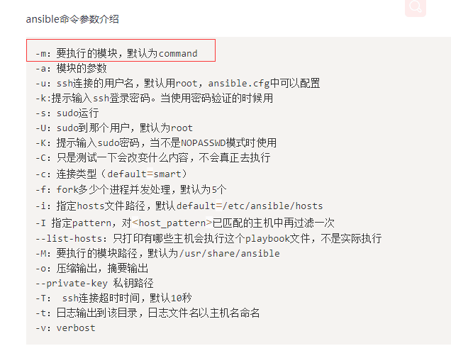
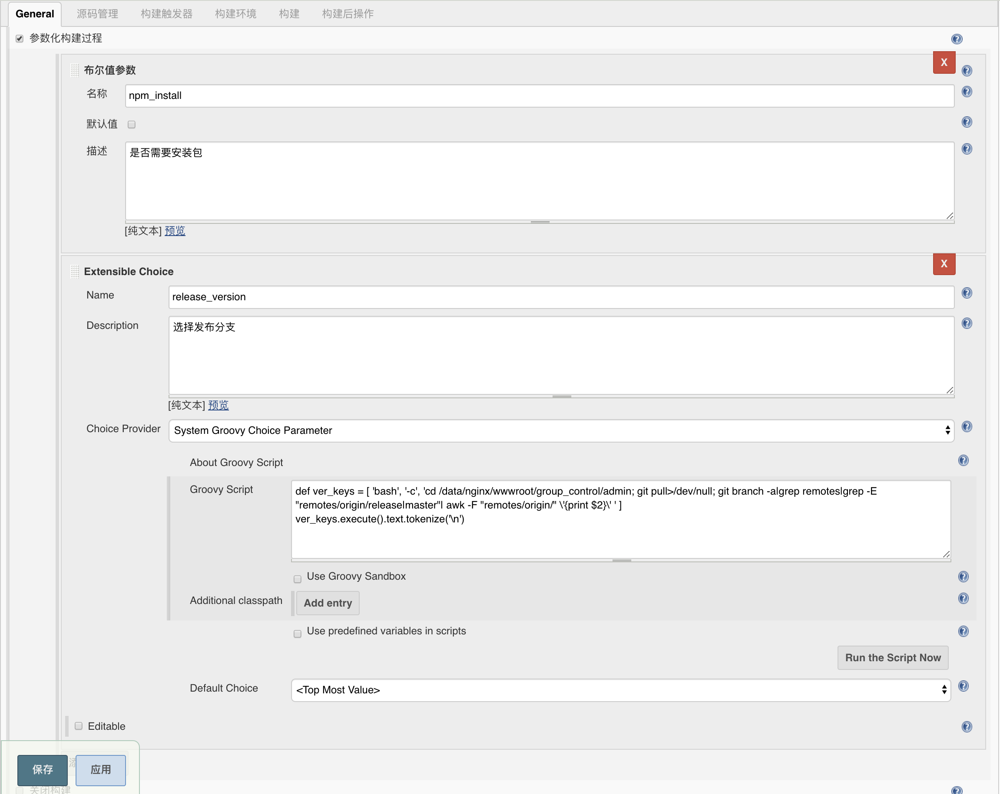

# ansible 发版

- ansible 常用命令


- 发版方式一：

> rsync + ansible, 已nodejs工程配置为例

```
def ver_keys = [ 'bash', '-c', 'cd /path/to/project; git pull>/dev/null; git branch -a|grep remotes|grep -E "remotes/origin/release|master"| awk -F "remotes/origin/" \'{print $2}\' ' ]
ver_keys.execute().text.tokenize('\n')
```



> shell

```
#!/bin/bash
set -e 

nowtime=`date +%Y-%m-%d,%H:%m:%s`
echo 'start'
echo $nowtime
echo $PROD_SH_N1 # Jenkins配置常量

echo $release_version
echo $npm_install

cd /path/to/project

echo `pwd`

sudo git pull origin $release_version


if [ $npm_install == 'true' ];then
	sudo npm install --verbose 
    # --registry https://registry.npm.taobao.org
fi

sudo npm run build

sudo chown -R www:www /path/to/project 

/usr/bin/rsync -avz --progress /path/to/project/dist y20@$PROD_SH_N1::xxx --exclude \/\. --password-file=/etc/rsyncd/rsyncpass
/usr/bin/rsync -avz --progress /path/to/project/dist y20@$PROD_SH_N2::xxx --exclude \/\. --password-file=/etc/rsyncd/rsyncpass
```


- ansible playbook

其他配置一致， shell：

```
#!/bin/bash
set -e 

nowtime=`date +%Y-%m-%d,%H:%m:%s`
echo 'start'
echo $nowtime

echo $release_version
echo $npm_install

cd /path/to/project

echo `pwd`

sudo git pull origin $release_version


if [ $npm_install == 'true' ];then
	sudo npm install --verbose 
    # --registry https://registry.npm.taobao.org
fi

cd /path/to/your ansible config

echo `pwd`

ansible-playbook -i hosts deploy.yml
```

- ansible playbook config
  - file: hosts
  ```
  [jenkins-node]
  ip1
  [server-node-1]
  ip1
  ip2
  ...
  [server-node-2]
  ip11
  ip22
  ...
  ```

  - file: deploy.yml
  
  ```yml
  ---
  - hosts: server-node-1
    remote_user: your user # like www
    become: yes                #2.6版本以后的参数，之前是sudo，意思为切换用户运行
    become_user: root
    tasks:
      - name: create git directory
        file:
        path: /path/to/project/
        state: directory

      - name: push local folder to remote host
        synchronize:
          src: /path/to/deploy/
          dest: /path/to/project/
      - name: pm2 restart
        shell: id ; chown -R www:www /path/to/deploy;  pm2 restart deploy.json
        register: exec_script
      - debug: var=exec_script.stdout_lines
  ```