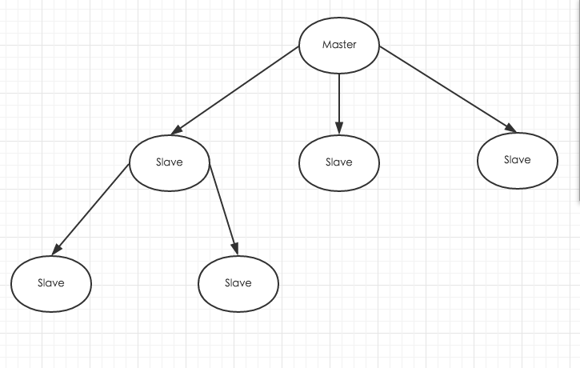

[Redis主从复制原理](https://www.cnblogs.com/hepingqingfeng/p/7263782.html)
--------------------------------------------------------------------

**前言：**

和[MySQL](http://lib.csdn.net/base/mysql)主从复制的原因一样，[Redis](http://lib.csdn.net/base/redis)虽然读取写入的速度都特别快，但是也会产生读压力特别大的情况。为了分担读压力，Redis支持主从复制，Redis的主从结构可以采用一主多从或者级联结构，Redis主从复制可以根据是否是全量分为全量同步和增量同步。下图为级联结构。

**1 全量同步**

　　Redis全量复制一般发生在Slave初始化阶段，这时Slave需要将Master上的所有数据都复制一份。具体步骤如下： 

　　1）从服务器连接主服务器，发送SYNC命令； 

　　2）主服务器接收到SYNC命名后，开始执行BGSAVE命令生成RDB文件并使用缓冲区记录此后执行的所有写命令； 

　　3）主服务器BGSAVE执行完后，向所有从服务器发送快照文件，并在发送期间继续记录被执行的写命令； 

　　4）从服务器收到快照文件后丢弃所有旧数据，载入收到的快照； 

　　5）主服务器快照发送完毕后开始向从服务器发送缓冲区中的写命令； 

　　6）从服务器完成对快照的载入，开始接收命令请求，并执行来自主服务器缓冲区的写命令； 

完成上面几个步骤后就完成了从服务器数据初始化的所有操作，从服务器此时可以接收来自用户的读请求。

**2 增量同步**

　　Redis增量复制是指Slave初始化后开始正常工作时主服务器发生的写操作同步到从服务器的过程。 

增量复制的过程主要是主服务器每执行一个写命令就会向从服务器发送相同的写命令，从服务器接收并执行收到的写命令。

**3 Redis主从同步策略**

　　主从刚刚连接的时候，进行全量同步；全同步结束后，进行增量同步。当然，如果有需要，slave 在任何时候都可以发起全量同步。redis 策略是，无论如何，首先会尝试进行增量同步，如不成功，要求从机进行全量同步。

**4 注意点**

如果多个Slave断线了，需要重启的时候，因为只要Slave启动，就会发送sync请求和主机全量同步，当多个同时出现的时候，可能会导致Master IO剧增宕机。